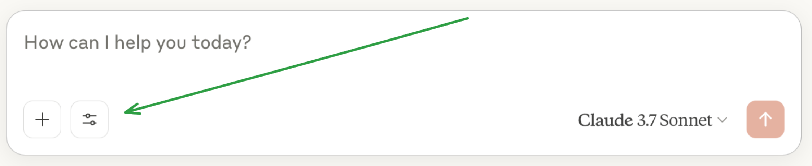

# YARA-WEBSHELL-MCP
## Installation steps:
Install uv:
```bash
pip install uv
```
Install Claude Desktop: https://claude.ai/download

Clone the repository and copy its path for later use:
```bash
git clone https://github.com/ilyasben26/yara-webshell-mcp
cd yara-webshell-mcp
pwd  
```
On Windows: create this file in `C:\Users\<user-name>\AppData\Roaming\Claude\claude_desktop_config.json` and provide the correct absolute path:
```json
{
  "mcpServers": {
    "weather": {
      "command": "uv",
      "args": [
        "--directory",
        "C:\\ABSOLUTE\\PATH\\TO\\PARENT\\FOLDER\\yara-webshell-mcp", 
        "run",
        "yara-webshell.py"
      ]
    }
  }
}
```
On Linux or MacOS: create this file in `~/Library/Application\ Support/Claude/claude_desktop_config.json`:
```json
{
  "mcpServers": {
    "weather": {
      "command": "uv",
      "args": [
        "--directory",
        "/ABSOLUTE/PATH/TO/PARENT/FOLDER/yara-webshell-mcp", 
        "run",
        "yara-webshell.py"
      ]
    }
  }
}
```
Restart Claude Desktop and you should see the MCP server appear as an option in the prompting form.

For troubleshooting, check this guide: https://modelcontextprotocol.io/quickstart/server#testing-your-server-with-claude-for-desktop